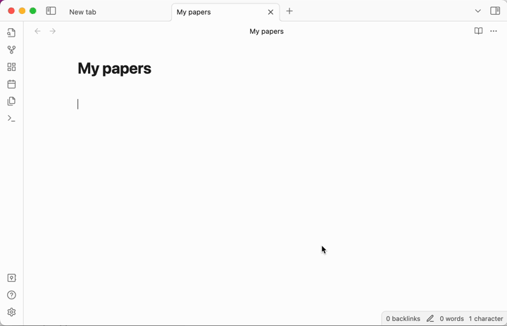

# arxiv2obsidian

This is a simple [Obsidian](https://obsidian.md/) plugin to download paper metadata from the arXiv.



## How to install

As the plugin is in beta mode, it is not available as an Obsidian community plugin. Instead, you can clone this repository in the `.obsidian/plugins` directory of your vault, and install it manually: 
```bash
mkdir -p .obsidian/plugins
cd .obsidian/plugins
git clone https://github.com/jvkersch/arxiv2obsidian
cd arxiv2obsidian
npm install
```
When this is done, go to the Obsidian settings and enable the plugin.

Note that you need Git as well as Node to build the plugin. If you are unsure of how to proceed, please follow the official instructions to [build an Obsidian plugin](https://docs.obsidian.md/Plugins/Getting+started/Build+a+plugin).

## Limitations

I wrote the plugin with the twin goals of (a) having a quick and dirty way of importing arxiv metadata, and (b) getting to know the Obsidian plugin development process. As a result, it may not fit your usecase right away. If so, please feel free to open an issue.

## License

This code is licensed under the [Apache 2.0 license](LICENSE-2.0.txt).